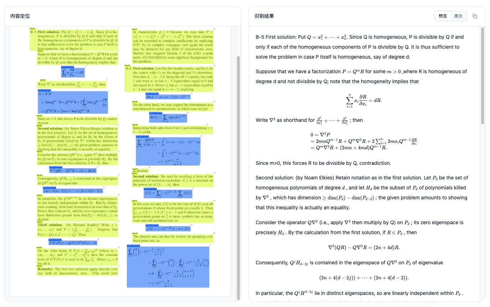

# ocr2md

`ocr2md` 提供本地 `GLM-OCR` 识别能力，面向单张图片和 PDF 文件，输出 Markdown 与结构化结果。项目同时提供：

- 本地 OCR Pipeline：`PageLoader -> LayoutDetector -> OCR Backend -> ResultFormatter`
- FastAPI Web API
- React Web 前端
- 模型目录检查、模型下载任务、OCR 异步任务轮询
- `docker compose` 本地一键启动

## 本地部署总览

本项目常见有两种启动方式：

- 开发模式：本地分别启动后端 API 和前端 Dev Server
- 使用 `docker compose` 启动单一服务入口

默认目录约定：

- 模型目录：`./models`
- 输出目录：`./output`
- 示例输入：`examples/source/`

## 方式一：本地启动前后端

### 1. 环境准备

- Python `>=3.12`
- Node.js `>=20`
- `uv`
- `npm`
- GPU 部署建议使用与 `CUDA 12.8` 兼容的环境

CUDA 说明：

- Docker 镜像当前基于 `nvcr.io/nvidia/cuda:12.8.1-cudnn-devel-ubuntu24.04`
- 如果你使用本地 GPU 或 Docker GPU 环境，请确保 NVIDIA Driver / CUDA Runtime 与 `CUDA 12.8` 兼容
- 如果只做前端开发或不启用 GPU 推理，可忽略这一项

安装 Python 依赖：

```bash
uv sync
```

安装前端依赖：

```bash
npm --prefix web install
```

如需显式指定配置文件，可先设置：

```bash
export OCR2MD_CONFIG=./ocr2md/config.yaml
```

### 2. 启动后端 API

```bash
uv run ocr2md-web --host 127.0.0.1 --port 8000
```

启动后可访问：

- API 根地址：`http://127.0.0.1:8000/api`
- 健康检查：`http://127.0.0.1:8000/api/health`

### 3. 启动前端

```bash
npm --prefix web run dev
```

默认前端地址：`http://localhost:8844`

开发模式下，Vite 会将 `/api` 代理到 `http://localhost:8000`。

### 4. 可选：构建前端静态资源

如果你希望由后端直接托管前端页面，而不是单独启动 Vite Dev Server，可以先构建前端：

```bash
npm --prefix web run build
```

构建完成后，后端会自动读取 `web/dist`，此时直接访问 `http://127.0.0.1:8000/` 即可打开前端页面。

## 方式二：使用 Docker Compose 本地启动

```bash
docker compose up --build
```

启动后统一入口为：

- Web 页面：`http://127.0.0.1:8000/`
- API 根地址：`http://127.0.0.1:8000/api`

当前 `docker-compose.yml` 的行为：

- 仅暴露本机端口：`127.0.0.1:8000:8000`
- 容器内使用配置：`/app/ocr2md/config.docker.yaml`
- 挂载宿主机模型目录：`./models:/app/models`
- 挂载宿主机输出目录：`./output:/app/output`
- 镜像构建时已内置前端静态资源，无需再单独启动前端容器
- Docker 环境下 `GLM-OCR` 和 `PP-DocLayout-v3` 都需要下载到挂载目录 `/app/models`

这意味着在默认 Docker 配置下，首次启动前需要准备或下载两类模型权重。

## 模型下载与使用

### 界面效果示例

下图是 Web 界面的实际识别效果：左侧展示版面定位结果，右侧展示 OCR 输出的 Markdown 预览，方便对照检查识别内容与原始区域。



使用时可以按照这个界面流转：

- 先确认模型状态为可用
- 上传图片或 PDF 文件
- 在左侧查看版面定位与区域切分是否合理
- 在右侧查看 Markdown 预览或切换到原文结果
- 如有公式、表格或复杂排版，可结合左右两栏快速定位问题

### 模型目录约定

本项目运行时会同时检查 OCR 模型和版面分析模型：

| 场景 | GLM-OCR | PP-DocLayout-v3 |
| --- | --- | --- |
| 本地开发默认配置 | `./models/glm-ocr` | `./models/pp-doclayout-v3` |
| Docker 默认配置 | `/app/models/glm-ocr` | `/app/models/pp-doclayout-v3` |

模型状态检查和下载任务会确保两类模型的必需文件齐全；如果版面模型已经存在，则会自动跳过对应文件。

### 下载前准备

模型下载任务依赖以下命令之一：

- `modelscope`
- `hf`

默认下载源为 `modelscope`，也可以切换为 `huggingface`。

模型仓库：

- GLM-OCR（ModelScope）：https://modelscope.cn/models/ZhipuAI/GLM-OCR
- PP-DocLayout-v3（ModelScope）：https://modelscope.cn/models/PaddlePaddle/PP-DocLayoutV3_safetensors

### 通过 Web/API 下载模型

1. 查看当前模型状态

```bash
curl http://127.0.0.1:8000/api/models/status
```

2. 可选：指定模型目录

```bash
curl -X POST http://127.0.0.1:8000/api/models/glm/set-dir \
  -H "Content-Type: application/json" \
  -d '{"model_dir":"./models"}'
```

`model_dir` 可以传模型根目录，也可以传具体的 `glm-ocr` 目录；程序会同时尝试推断 GLM 和 layout 的实际目录。

3. 发起下载任务

```bash
curl -X POST http://127.0.0.1:8000/api/models/glm/download \
  -H "Content-Type: application/json" \
  -d '{"source":"modelscope","model_dir":"./models"}'
```

4. 轮询下载任务状态

```bash
curl http://127.0.0.1:8000/api/tasks/<task_id>
```

前端页面也提供同样的模型状态查看、目录设置和下载入口。

### 使用方式

#### Web 页面

- 打开前端页面后上传图片或 PDF
- PDF 支持页码选择，格式如 `1,3-5`
- OCR 任务会异步执行，并通过 `/api/tasks/{task_id}` 轮询结果
- 左侧为内容定位视图，右侧为识别结果视图，适合边看版面边核对输出文本

#### Web API 同步识别

```bash
curl -X POST http://127.0.0.1:8000/api/ocr/run \
  -F 'file=@examples/source/paper.png'
```

#### Web API 异步识别

```bash
curl -X POST http://127.0.0.1:8000/api/ocr/jobs \
  -F 'file=@examples/source/GLM-4.5V.pdf' \
  -F 'page_selection=1-2'
```

然后轮询：

```bash
curl http://127.0.0.1:8000/api/tasks/<task_id>
```

#### 本地 CLI

```bash
uv run ocr2md examples/source/paper.png --output ./output --stdout
```

仅运行版面分析：

```bash
uv run ocr2md-layout examples/source/paper.png --output ./output
```

## 配置

配置文件默认会自动发现 `ocr2md/config.yaml`，也可以通过环境变量或命令行参数指定：

- 环境变量：`OCR2MD_CONFIG`
- Web CLI：`uv run ocr2md-web --config <path>`
- 本地 CLI：`uv run ocr2md --config <path>`

常用配置项：

| 配置项 | 作用 |
| --- | --- |
| `web.host` / `web.port` | Web 服务监听地址和端口 |
| `web.upload_max_mb` | 上传文件大小限制 |
| `web.allowed_image_suffixes` | 允许上传的文件类型 |
| `web.task_ttl_seconds` | 任务状态保留时间 |
| `web.model_timeout_seconds` | 单模型超时控制 |
| `pipeline.output.base_output_dir` | OCR 输出目录 |
| `pipeline.glm_ocr_backend.model_dir` | GLM 模型目录 |
| `pipeline.glm_ocr_backend.download_source` | GLM 下载源 |
| `pipeline.layout.model_dir` | PP-DocLayout 模型目录 |
| `pipeline.page_loader.pdf_dpi` | PDF 转图 DPI |

需要注意：

- 本地默认配置在 `ocr2md/config.yaml`
- Docker 默认配置在 `ocr2md/config.docker.yaml`
- 如果你修改了配置模型，请保持 `ocr2md/config.py` 和对应 YAML 文件同步
- `config.docker.yaml` 当前默认允许上传图片，不包含 `pdf`；如果 Docker 场景也要上传 PDF，请把 `pdf` 加到 `web.allowed_image_suffixes` 后重启服务

## 开发相关

常用命令：

```bash
uv sync
npm --prefix web install
uv run ocr2md-web --help
uv run ocr2md --help
```

代码质量检查：

```bash
uv run pre-commit run -a
```

或：

```bash
uv run black .
uv run flake8 ocr2md
```

前端构建检查：

```bash
npm --prefix web run build
```

建议使用 `examples/source/` 下的样例图片和 PDF 做本地联调与回归验证。
